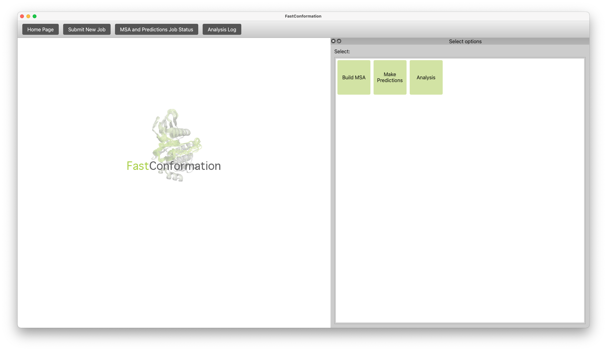

Here's a comprehensive README based on the abstract of your paper:

---

# FastEnsemble


[](https://github.com/REPLACE_WITH_OWNER_ACCOUNT/decaf_e_dev/actions?query=workflow%3ACI)
[](https://codecov.io/gh/REPLACE_WITH_OWNER_ACCOUNT/decaf_e_dev/branch/main)

FastEnsemble is a Python-based application that integrates MSA generation, structure prediction via AlphaFold 2 (AF2), and interactive analysis, all in one place. This user-friendly tool is designed to help researchers in structural biology, biochemistry, drug discovery, and protein engineering generate and analyze protein conformational ensembles without requiring extensive programming knowledge.

## Citation
If you use FastEnsemble, please cite our paper! 

Monteiro da Silva, G., Cui, J.Y., Dalgarno, D.C. et al. High-throughput prediction of protein conformational distributions with subsampled AlphaFold2. Nat Commun 15, 2464 (2024). https://doi.org/10.1038/s41467-024-46715-9 

## Table of Contents
- [Features](#features)
- [Installation](#installation)
- [Download Sample Files](#download-sample-files)
- [Contributing](#contributing)
- [License](#license)
- [Acknowledgements](#acknowledgements)

## Features

- **MSA Generation**: Automatically generate multiple sequence alignments (MSAs) from amino acid sequences using JACKHMMER and MMSEQ.
- **Structure Prediction**: Predict protein structures using ColabFold's implementation of AlphaFold 2 (AF2).
- **Conformational Ensembles**: Generate alternative protein conformations through random MSA subsampling.
- **Interactive Analysis**: Analyze protein conformational ensembles and the effects of mutations on protein dynamics using our suite of analysis tools.
- **User-Friendly GUI**: Accessible through an intuitive graphical user interface suitable for non-programmers.



## Installation

To install FastEnsemble, run the installation script provided in the repository:

```bash
./install_decaf.sh
```

This script will set up the necessary environment and dependencies.

## Dependencies

The installation script sets up the environment and installs all necessary dependencies. 

FastEnsemble relies on the following dependencies:

### Conda Packages

- `git`
- `python=3.10`
- `openmm==7.7.0`
- `pdbfixer`
- `kalign2=2.04`
- `hhsuite=3.3.0`
- `mmseqs2=15.6f452`
- `hmmer`
- `scikit-learn`
- `mdanalysis`
- `seaborn`
- `scipy`

### Python Packages (via pip)

- `PyQt5`
- `pandas`
- `pyqt`
- `matplotlib`
- `silence_tensorflow`
- `pyqtgraph`
- `colabfold`
- `silence_tensorflow`
- `pdb-tools`


## Documentation

Documentation can be found on ReadTheDocs.

## OS Requirements

This package has been tested on Linux RedHat7.

## Usage

### Running the GUI

To start the graphical user interface, execute the following command:

```bash
python run_gui.py
```

This will launch the main application window, where you can access various functionalities such as submitting new jobs, checking job status, and viewing analysis logs.

## Download Sample Files

To get started quickly, download the sample files from the link below and add them to the root directory of the project:

[Download Sample Files](https://drive.google.com/drive/folders/1ev5HfWVyMTBw3FRtKWxYaswuaIXvC1FS?usp=drive_link)

## Contributing

We welcome contributions to FastEnsemble. If you would like to contribute, please follow these steps:

1. Fork the repository.
2. Create a new branch (`git checkout -b feature-branch`).
3. Make your changes.
4. Commit your changes (`git commit -m 'Add some feature'`).
5. Push to the branch (`git push origin feature-branch`).
6. Create a new Pull Request.

Please ensure your code follows our coding standards and includes appropriate tests.

## License

FastEnsemble is licensed under the MIT License. See the [LICENSE](LICENSE) file for more details.


## Acknowledgements

Project based on the [Computational Molecular Science Python Cookiecutter](https://github.com/molssi/cookiecutter-cms) version 1.1. 


